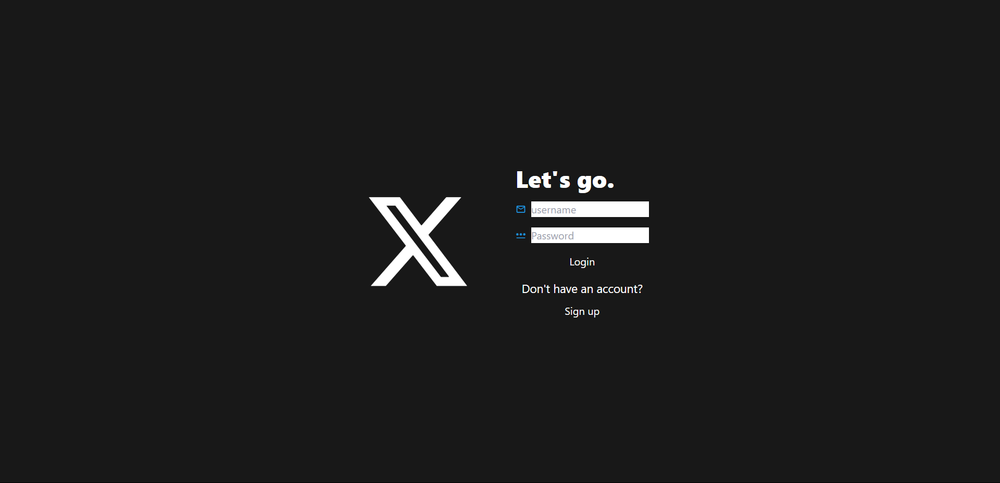
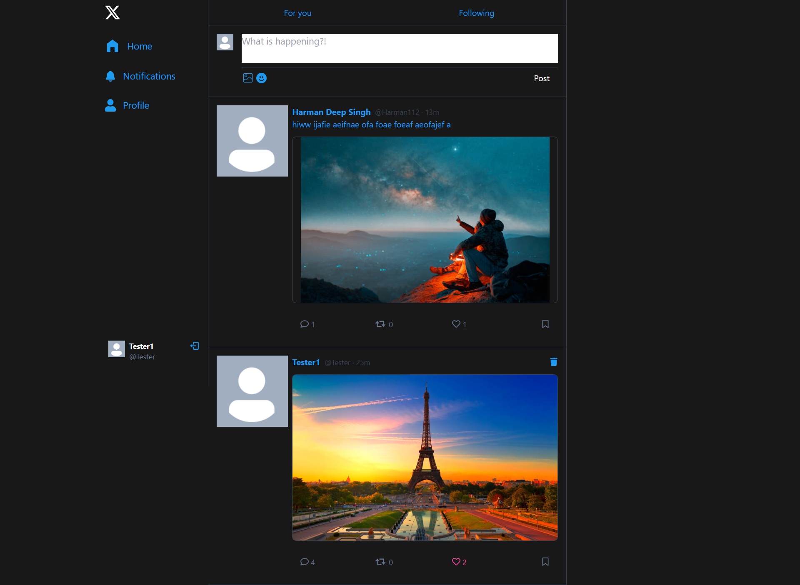
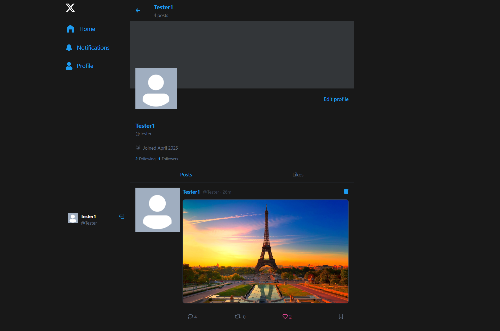
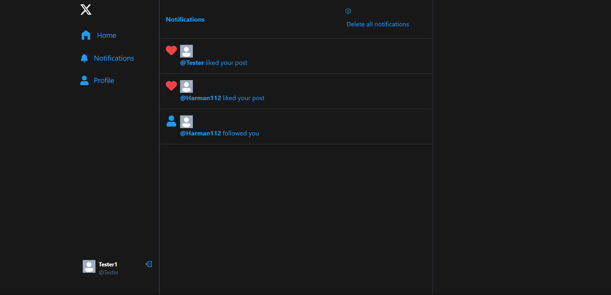

# Twitter Clone

A full-stack Twitter-like social media application built with **React**, **Vite**, **TailwindCSS**, **Node.js**, **Express**, and **MongoDB**. This project demonstrates a modern web application with features like user authentication, posts, notifications, and real-time messaging.

---

## Image and Video Showcase

### Screenshots
Login page

Home page

Profile page

Notification page



### Video Demo

https://github.com/user-attachments/assets/9e0289f7-6443-415b-8dc1-411cff385607

---


## Features

- User authentication (signup, login, logout)
- Create, like, and comment on posts
- Follow/unfollow users
- Notifications for user interactions
- Real-time messaging between users
- Responsive design with TailwindCSS
- Backend API with Express and MongoDB

---

## Made Using

This project was built using a **YouTube tutorial** as a reference and modified to include additional features and improvements.

---

## Project Structure

```
twitter-clone/
├── .env                  # Environment variables (not included in version control)
├── .gitignore            # Files and folders to ignore in Git
├── LICENSE               # Project license
├── package.json          # Project metadata and scripts
├── backend/              # Backend codebase
│   ├── controllers/      # API controllers
│   ├── db/              # Database connection logic
│   ├── lib/             # Utility functions
│   ├── middleware/      # Middleware for authentication
│   ├── models/         # Mongoose models
│   ├── routes/         # API routes
│   ├── server.js       # Main server entry point
│   └── Docs.md        # Backend documentation
├── frontend/             # Frontend codebase
│   ├── public/          # Static assets
│   ├── src/             # React application source code
│   ├── index.html       # Entry HTML file
│   ├── package.json     # Frontend dependencies and scripts
│   ├── tailwind.config.js # TailwindCSS configuration
│   ├── vite.config.js   # Vite configuration
│   └── README.md        # Frontend documentation
└── Screenshot/           # Project screenshots
    ├── image1.png
    ├── image2.png
    ├── video_demo.mp4
```

---

## Installation

### Prerequisites

- Node.js (v16 or higher)
- MongoDB (running locally or on a cloud service like MongoDB Atlas)

### Steps

1. Clone the repository:
   ```bash
   git clone https://github.com/your-username/twitter-clone.git
   cd twitter-clone
   ```
2. Install dependencies for both backend and frontend:
   ```bash
   npm install
   npm install --prefix frontend
   ```
3. Create a `.env` file in the root directory and configure the following variables:
   ```env
   PORT=5000
   MONGO_URI=your_mongodb_connection_string
   JWT_SECRET=your_jwt_secret
   CLOUDINARY_CLOUD_NAME=your_cloudinary_cloud_name
   CLOUDINARY_API_KEY=your_cloudinary_api_key
   CLOUDINARY_API_SECRET=your_cloudinary_api_secret
   ```
4. Start the development server:
   ```bash
   npm run dev
   ```
5. Open the app in your browser at `http://localhost:3000`.

---

## Scripts

```bash
npm run dev      # Starts the backend server with nodemon and the frontend development server.
npm run build    # Builds the frontend for production.
npm start       # Starts the backend server in production mode.
```

---

## Backend Overview

The backend is built with Node.js, Express, and MongoDB. It provides RESTful APIs for user authentication, posts, notifications, and messaging.

### Key Files and Folders

- **`server.js`**: Main entry point of the backend server.
- **`controllers/`**: Contains logic for handling API requests.
- **`models/`**: Mongoose models for MongoDB collections.
- **`routes/`**: Defines API endpoints.
- **`middleware/`**: Middleware for authentication and route protection.
- **`db/connectMongoDB.js`**: Handles MongoDB connection.

For detailed backend documentation, see `Docs.md`.

---

## Frontend Overview

The frontend is built with React, Vite, and TailwindCSS. It provides a responsive and interactive user interface for the application.

### Key Files and Folders

- **`src/`**: Contains the main React application code.
- **`components/`**: Reusable UI components.
- **`pages/`**: Page components for routing.
- **`hooks/`**: Custom React hooks.
- **`utils/`**: Utility functions.
- **`index.html`**: Entry HTML file for the Vite app.
- **`tailwind.config.js`**: TailwindCSS configuration.

For detailed frontend documentation, see `frontend/README.md`.

---

## API Endpoints

### Auth Routes

- `POST /api/auth/signup` → Register a new user.
- `POST /api/auth/login` → Log in a user.
- `POST /api/auth/logout` → Log out a user.

### User Routes

- `GET /api/users/profile/:username` → Get user profile.
- `POST /api/users/follow/:id` → Follow/unfollow a user.

### Post Routes

- `POST /api/posts/create` → Create a new post.
- `POST /api/posts/like/:id` → Like/unlike a post.

### Notification Routes

- `GET /api/notifications` → Get user notifications.
- `DELETE /api/notifications` → Clear notifications.

### Message Routes

- `POST /api/messages/send` → Send a message.
- `GET /api/messages/:userId` → Get messages with a user.


## License

This project is licensed under the MIT License.

---

## Contributing

Contributions are welcome! Please fork the repository and submit a pull request.

